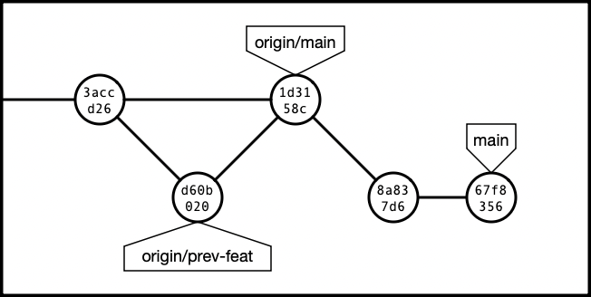
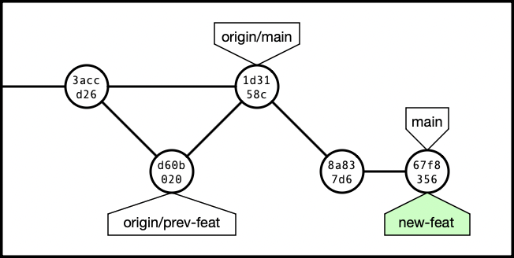

# Move a Commit to a New Branch

Many companies or teams have a policy that all work needs to be done on a "feature branch", which is then merged into a "primary branch" using a pull request. This allows people *other than yourself* to review your work before it gets merged into the main code.

I'm not perfect, sometimes I forget to create a new branch first, and accidentally create commits directly on the primary branch. Usually I realize this *before* pushing anything, which means I can fix it on the local machine first.


### Quick Explanation

It helps if you remember that a "branch" is just a name, pointing to a commit.

What we're going to do is this:

* Create the new branch, pointing to the last of the new commits.

* Move the `main` branch to point to what it *was* pointing at before we started creating commits.

## Starting Condition

In this examples below, we're going to assume that the recent commits in the repo look like this:

```
$ git tree1 -a
* 67f8356 (HEAD -> main) 2024-06-20 jms1(G) fix typo
* 8a837d6 2024-06-20 jms1(G) start new feature
*   1d3158c (origin/main) 2024-06-13 jms1(G) Merge branch 'prev-feat'
|\
| * d60b020 (origin/prev-feat) 2024-06-12 jms1(G) previous feature
|/
* 3accd26 2024-05-29 jms1(G) Merge branch 'old-feat'
```



> &#x2139;&#xFE0F; `git tree1`
>
> This is one of [my standard git aliases](config.md#my-usual-aliases). It actually means ...
>
> ```
> git log --date-order --decorate --graph --no-show-signature '--pretty=tformat:%C(auto)%h%d %C(brightcyan)%as %C(brightgreen)%al(%G?)%C(reset) %s'
> ```
>
> ... although you won't see the colours in the copy/pasted text on this page.

In this case, I created two commits, `8a837d6` then `67f8356`, then realized I should have created a feature branch for it first.

## Create a New Branch

The first part of fixing this is to create a new branch, pointing to what *should be* the HEAD of that new branch. The current HEAD is *already* pointing to that commit, so if we just create the new branch here, we'll be good.

```
$ git branch new-feat
```

Looking at the repo after this, you can see that the new "`new-feat`" branch exists and is pointing to the correct commit.

```
$ git tree1 -a
* 67f8356 (HEAD -> main, new-feat) 2024-06-20 jms1(G) fix typo
* 8a837d6 2024-06-20 jms1(G) start new feature
*   1d3158c (origin/main) 2024-06-13 jms1(G) Merge branch 'prev-feat'
|\
| * d60b020 (origin/prev-feat) 2024-06-12 jms1(G) previous feature
|/
* 3accd26 2024-05-29 jms1(G) Merge branch 'old-feat'
```



## Move the `main` Branch

This will move the `main` branch to point to the commit that it was pointing to before we started working on the new branch.

### Identify the commit where the branch *should* point

First, identify the commit that it *should* be pointing to.

In this example, the `main` branch *should* be pointing to commit `1d3158c`. You can refer to the commit using its hash, or using any other branch or tag name which points to that commit. In many cases, `origin/main` will be usable.

### Check out the branch you're moving

Next, make sure the branch you're moving (in this case, `main`) is checked out.

```
$ git checkout main
```

In this example, it wasn't really necessary because we were already on the `main` branch. However, I've trained myself to always do this, just to be on the safe side.

### Move the branch

The `git reset` command changes what the *current* branch points to.

```
$ git reset --hard 1d3158c
```

At this point the repo will look like this:

```
$ git tree1 -a 67f8356
* 67f8356 (new-feat) 2024-06-20 jms1(G) fix typo
* 8a837d6 2024-06-20 jms1(G) start new feature
*   1d3158c (HEAD -> main, origin/main) 2024-06-13 jms1(G) Merge branch 'prev-feat'
|\
| * d60b020 (origin/prev-feat) 2024-06-12 jms1(G) previous feature
|/
* 3accd26 2024-05-29 jms1(G) Merge branch 'old-feat'
```


As you can see ...

* The `main` branch now points to the commit that it *would* have pointed to if we had created the new branch before creating any commits.

* The new `new-feat` branch points to the most recent commit in the work you've already done.


## Keep Working

At this point, the problem is fixed. You can continue working as if you *had* created the branch before starting, including pushing the new branch to a remote and creating a pull request.


## If you had already pushed

If you had already pushed the "bad" state to another remote (such as a "git server"), you'll need to "force push" the corrected branch to that same remote.

```
git push -f main
```

If you force-push a branch in a repo that other people use, you need to let those other people know as soon as possible that you've done so. If they had fetched changes to *their* workstations during the time that the remote's `main` was pointing to the wrong commit, their workstation's idea of `origin/main` (and possibly their local `main`) will still be pointing to the wrong commit.

In this case, they will need to update their local repo from the primary server, and possibly update their local `main` branch to point to the updated branch on the remote (aka `origin/main`), as soon as possible. Ideally they should do this *before* creating any new branches, or adding any commits to the branch you force-pushed. If they don't, it can cause ... problems.

* If they have any un-committed changes,

* Fetch changes from the remote server.

    ```
    git fetch origin
    ```

* Force-update their local `main` branch to point to `origin/main`.

    ```
    git checkout main
    git reset --hard origin/main
    ```
