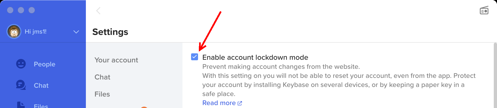

# Lost Access

If you have lost all *devices* which are on your keybase account, and you don't have an active paperkey on the account (or if you've lost the paperkey) ... I'm sorry, but **there is no way to recover any content stored in your account**.

## Resetting Your Account

There is a way to "reset" your account. This works by starting a new "signature chain" (or "sigchain") for the username. Doing this replaces the old sigchain, which means that any encryption keys *currently* attached to the account, will no longer be attached to the account.

> &#x2139;&#xFE0F; **Signature Chains**
>
> Each Keybase account has a chain of digital signatures. Each signature represents a statement by an *existing* device, authorizing a change to the list of encryption keys attached to the account. This happens when you add or remove devices, paperkeys, PGP keys, or identity proofs.
>
> Signature chains are public. You can see any Keybase account's signature chain by visiting `https://keybase.io/USERNAME/sigchain`. For example, [this](https://keybase.io/jms1/sigchain) is the sigchain on my own Keybase account.

**Resetting your account should only be considered as a final resort.** If you do this, any content that was previously stored in your account will be *permanently* lost. This includes ...

* **Teams:** You will be removed from any teams that you may be a member of.

    * If you were the only person with *owner* access to a team, resetting the account will leave the team without an owner. Other members who have *admin* access to the team will be able to add you back to the team as a member or as an admin, but there is no way for anybody to make you (or anybody else) an owner.

    * If you are the only person with *owner or admin* access to a team, resetting your account will leave that team without any way to manage members at all. Current members will remain members, but there won't be any way for *anybody* to add or remove members going forward.

    * Because of this, it's important to be sure that every team has multiple owners, even if the second owner is a "backup account" with a paperkey stored somewhere safe ... just like you should be doing with your primary account.

* **Files:** You will no longer have access to any encrypted files, other than *other users'* public files.

    * Files under `/keybase/private/USERNAME/` and `/keybase/public/USERNAME/` will be lost.

    * Files under `/keybase/team/` will still exist as part of that team, however your new account will not have access to them unless a team owner/admin adds you back to the team.

* **Git repositories:** You will no longer have access to any encrypted git repos that your "old" account had.

    * Repos under `keybase://private/USERNAME/` will be lost.

    * Repos under `keybase://team/` will still exist, but your "new" account won't have access to them unless a team owner/admin adds you back to the team.

    Note that if you have an up-to-date clone of a Keybase repo on a computer somewhere, that *could* be used to create a new repo with the same commit history. However, computers need to be devices on your account in order to *access* Keybase git repos in the first place, so if you *do* have a cloned copy, chances are the computer involved *is* a device on your account, and you shouldn't need to reset the account.

* **Chat:** You will no longer have access to any chat history.

    * For person-to-person (non-team) chats, the other people involved will still have access to the history, however the conversation will essentially be over. If you start a new conversation with them (or they try to chat with you) after you reset your account, it will be a new conversation.

    * For team chats, *if your "new" account is added to the team again*, you would regain access to the existing history.

**If you reset your account and later find one of your devices or paperkeys, it will no longer be able to log into your account.**

Essentially, the only time you should consider resetting your account is if you are 100% sure that you will *never* regain access to a device or paperkey which has access to the account. If there is *any* chance of finding one of these, you're better of creating a new Keybase account with a different username.

**If your account is in [Lockdown mode](https://book.keybase.io/docs/lockdown), the account cannot be reset except from an active device.** And if you *have* an active device, you shouldn't *need* to reset the account in the first place.

I do this for my own Keybase accounts, but I also have paperkeys for each account which are *physically written down* and stored in safe places.

### How to Reset Your Account

After reading everything above, if you're 100% sure you want to reset your account ...

* Visit [keybase.io](https://keybase.io/)
* Use the "Login" link at the top right to log into your account. You will need the username and password.
* Near the top right of your profile will be a "gear" button.

## In the Meantime

After reading everything above, it should be obvious that you need more than just one device on your account, so you will be able to regain access to your account in case you lose all of your devices.

Assuming you still *have* access to your Keybase account ...

* Read through the [Before You Lose Access](before.md) page.
* If possible, make sure there are multiple devices on your account.
* If you don't have more than one device, or if you want to be sure you have a way to regain access in case *all* of your devices are lost, make sure you have a paper key on your account.
