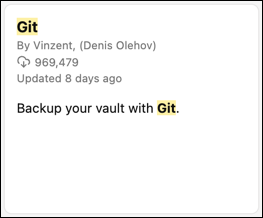

# Adding obsidian-git to an Existing Vault

**2024-06-30**

This page covers how to add obsidian-git to a vault. It covers both newly created vaults and existing vaults, as long as no git repository exists for them yet. If you already have a git repository for a vault and just need to link a new computer to it, see the "[Clone an Existing Vault](clone.md)" page instead.

> Note that this page started out as two separate notes - one about creating a new vault with obsidian-git, and one about adding obsidian-git to an existing vault. When I added these notes to the `jms1.info` site, I noticed that a lot of the content was the same, so I'm combining them into a single page. Depending on when you see this, you might notice some duplicated content.

# Creating a New Vault

**If you don't already have a vault** that you plan on using obsidian-git with, the obvious first step would be to create one. Use Obsidian's standard process of creating a new vault, nothing special.

Assuming Obsidian is already running ...

* Click the  icon in the ribbon on the left.

* In the dialog that appears, next to "Create new vault", click "Create".

* Next to "Vault name", enter a name for the new vault.

* Next to "Location", click "Browse".

* In the file browser dialog, navigate to the *parent* directory of the new vault. For example, on macOS I navigate to the `$HOME/Documents/Obsidian/` directory. Then click "Open" at the bottom.

* Back in Obsidian, click "Create".

> For the purposes of this document, I created a vault called "sample" in the `$HOME/Documents/Obsidian/` directory.

# Set up the git repo

This will set up a git repository *within the vault*. This is all you'll need in order to start tracking changes over time.

Once this is done, you can sync the repo with another location (such as Github, Keybase, or a directory on a shared drive),. This will be covered below - but either way, you need to create the repository within the vault first.

## Create the repo itself

In a command line ...

```
cd ~/Documents/Obsidian/sample/
git init -b main
```

## Create a `.gitignore` file

This file contains a list of filename patterns that `git` should not add to, or update in, the repo.

Use a text editor to create a file with the name `.gitignore`, in the root of the repo (aka the Vault directory - technically, whatever directory you were in when you ran the `git init` command). I normally use `nano` or [BBEdit](https://www.barebones.com/products/bbedit/index.html) for this, others may use editors like `vi`, `vim`, or [Sublime Text](https://www.sublimetext.com/).

The contents of the file will depend on what you do and don't want stored in the git repo. The file I use looks like this:

```
.DS_Store
._*

.obsidian/*
!.obsidian/app.json
!.obsidian/appearance.json
!.obsidian/config
!.obsidian/community-plugins.json
!.obsidian/core-plugins.json
!.obsidian/graph.json
!.obsidian/hotkeys.json
!.obsidian/plugins
!.obsidian/snippets
!.obsidian/themes
```

* The first two entries, `.DS_Store` and `._*`, are files that macOS creates on filesystems which don't support Apple's "resource fork" mechanism.

    I include these two entries in the `.gitignore` files for *every* repo I create.

* The `.obsidian/*` entry tells `git` to ignore all files within the vault's `.obsidian/` directory.

* The `!.obsidian/xxx` entries tell `git` to NOT ignore those particular files. This means that those files *will* be tracked over time and possibly sync'ed between computers.

## Create the first commit

A git "commit" records a set of changes to the files in the working directory.

```
git add .
```

This command will "stage" every file in the current directory (and its children) to be included in the next commit. This will *not* include any files listed in the `.gitignore` file, although in this case it *will* include the `.gitignore` file itself.

If you're curious, you can run `git status` to see which files have been staged.

```
git commit -m 'initial commit'
```

This command will create a commit, containing the files you just added. Each commit has a message explaining what the changes in the commit are doing, the `-m 'initial commit'` is supplying that message. Feel free to use a different message if you like.

Note that commit messages are required. If you don't include a `-m` option, `git` will open your text editor and ask you to enter a message. If you don't enter one, it will not create a commit.

# Set up a remote

If you plan to sync the git repo with any remotes, now is the best time to set that up.

## If you're using Github

### Using the web interface

If you're using the Github web interface, create a new repo. DO NOT use any of their options to create "starter" files (such as `README` or `.gitignore`) automatically, the repo you create needs to be 100% empty.

### Using the `gh` command line tool

If you're using the [`gh` command line tool](https://cli.github.com/), the command will look like this:

```
gh repo create USERNAME/REPONAME --private --disable-issues --disable-wiki
```

* You must include either `--private` or `--public`. You could also use `--internal` if the repo is owned by an organization, to make it accessible to members of the organization but not to the entire world.

* The `--disable-issues` and `--disable-wiki` options will turn those features off when the repo is created. Other options may be available, `gh repo create -h` will show them to you.

### Get the new repo's URL

However you created the repo, the output should give you a `git remote add` command line, or at least a URL which can be used in that command. The URL will look like one of these:

* For HTTPS: `https://github.com/USERNAME/REPONAME`
* For SSH: `git@github.com:USERNAME/REPONAME`

Github repos can be accessed using HTTPS or SSH. Both of them work, but they handle authentication differently. Using HTTPS involves either having to enter your password for every `git` operation, or using an "authentication helper" program which may store the password in plain text on the system. (The macOS authentication helper stores it in the system's keychain, which is encrypted.)

> &#x2139;&#xFE0F; Personally I prefer to use SSH, since it uses my SSH keys to authenticate. This means that the SSH agent handles authentication requests automatically. If your SSH secret keys are stored on the computer, you'll have to enter the SSH key's passphrase the first time you use it, but after that the SSH agent will remember the key and not need to ask for the passphrase again.
>
> In my case, the SSH agent passes the requests along to the [Yubikey](../../yubikey/index.md) which has my SSH secret key on it. I have to enter the Yubikey's PIN once to unlock it, and it stays unlocked until I remove the Yubikey from the computer. This means I don't have to store my Github password *or* my SSH secret key on the computer.

If all you have is the URL, you can build the command line. This will be explained in the "[Add the remote](#add-the-remote)" section below.

## Keybase

Keybase git repos can be owned by an individual user, or by a team. In the case of a user, only that user will have access to the repo. For a team, all members of the team will have access to the repo, and people can gain or lose access to the repo by being added to or removed from the team. In addition, team members with `reader` access will have read-only access to the repo (i.e. they can clone and fetch commits, but they won't be able to push.)

Note that Keybase's git repos do not offer features like pull requests - just cryptographically secure hosting of the git repos themselves.

### Private repo

```
$ keybase git create obsidian-git-sample
Repo created! You can clone it with:
  git clone keybase://private/USERNAME/obsidian-git-sample
Or add it as a remote to an existing repo with:
  git remote add origin keybase://private/USERNAME/obsidian-git-sample
```

As you can see, this shows you the `git remote add` command you'll need below.

### Team repo

```
$ keybase git create --team TEAMNAME obsidian-git-sample
Repo created! You can clone it with:
  git clone keybase://team/TEAMNAME/obsidian-git-sample
Or add it as a remote to an existing repo with:
  git remote add origin keybase://team/TEAMNAME/obsidian-git-sample
```

As you can see, this shows you the `git remote add` command you'll need below.

## Add the remote to the repo

The next step is to tell the local git repo (the files in the `.git/` directory) that the remote exists, and how to find it. This is done using the `git remote add` command.

When you created the repo, it should have given you either a URL or an actual `git remote add` command. If you just have a "remote string", you can put `git remote add origin` in front of it. (The word `origin` is traditionally the name of the remote, for repos which only *have* a single remote.)

Examples:

* `git remote add origin git@github.com:USERNAME/obsidian-git-sample` (using SSH)
* `git remote add origin https://github.com/USERNAME/obsidian-git-sample` (using HTTPS)
* `git remote add origin keybase://private/USERNAME/obsidian-git-sample`

### Push the commits

After adding the remote, the next step is to push whaetver commits (and tags) are currently in the repo, "up" to the remote.

**The first time you do this**, you also need to link the local `main` branch to the `main` branch you'll be creating when you push the commits.

```
git push -u origin main
```

**After this**, you'll be able to use `git push` by itself. Because the local `main` branch is linked to the remote `main` branch, `git push` will know which branches to push where automatically.

```
git push
```

### Keybase: fix the repo on the server

Keybase's git server has a bug where it assumes that every git repo has a branch called `master`. If the repo doesn't *have* a branch with this name, then `git clone` won't be able to clone new copies of the repo without explicitly naming the branch they want to check out at the end of the cloning operation.

Historically, the name "master" was used as the default branch name for newly created repos. The `git init` command still uses this as the default, but the documentation has a note saying that this will change in the future.

Some people consider the word "master" to be offensive (because it refers to slavery) so many people (myself included) now use `main` as the name of a git repo's primary branch.

Keybase doesn't provide a *command* to change the name of a repo's primary branch, however they do provide a mechanism to manually access the files on their "git server", and if you're careful, you can change it by hand.

* For a private repo

    ```
    echo 'ref: refs/heads/main' \
        > /keybase/private/USERNAME/.kbfs_git/obsidian-git-sample/HEAD
    ```

* For a team repo

    ```
    echo 'ref: refs/heads/main' \
        > /keybase/team/TEAMNAME/.kbfs_git/obsidian-git-sample/HEAD
    ```

If you're using Keybase git, you should do this before anybody else (including yourself) tries to `git clone` the repo.

> &#x2139;&#xFE0F; If you don't do this, you can specify the correct branch when cloning the repo, like so:
>
> ```
> git clone -b main keybase://team/TEAMNAME/REPONAME
> ```


# Add the obsidian-git plugin

Run Obsidian, and open the vault you want to use the obsidian-git plugin with.

* Click  on the ribbon on the left. (On macOS you can press "&#x2318;," for this.)

* Select "Community plugins" on the left.

* Next to "Community plugins", click the "Browse" button.

* Enter "git" in the search box at the top of the window. Look for the "Git" plugin.

    

* Click on the plugin.

* Click on the "Install" button.

* After installing it, click the "Enable" button.

* Close the settings window (the X at the top right)

### Configure the plugin

Feel free to use whatever settings you like. These are the settings I'm using.

Note that the list of settings may be different from one version to the next. The list below is from 2.24.3.

Obsidian Settings (   or &#x2318;, )

- Under "Community plugins" at the bottom, "git"

    Automatic

    - Split automatic commit and push: NO
    - Vault commit interval (minutes): 5
    - Auto Backup after stopping file edits: YES
    - Auto pull interval (minutes): 0
    - Specify custom commit message on auto backup: NO
    - Commit message on auto backup/commit: `auto backup: {{date}} from {{hostname}}`

    Commit message

    - Commit message on manual backup/commit: `manual backup {{date}} from {{hostname}}`
    - `{{date}}` placeholder format: `YYYY-MM-DD HH:mm:ss`
    - `{{hostname}}` placeholder replacement: whatever hostname you use for the current machine
        - This is specific to each machine, not sync'ed to the git repo.
    - Preview commit message
    - List filenames affected by commit in the commit body: YES

    Backup

    - Sync Method: Merge
    - Pull updates on startup: YES
    - Push on backup: YES
    - Pull changes before push: YES

    Line author information

    - Show commit authoring information next to each line: NO

    History View

    - Show Author: Hide
    - Show Date: YES

    Source Control View

    - Automatically refresh Source Control View on file changes: YES
    - Source Control View refresh interval: 7000 (default)

    Miscellaneous

    - Disable notifications: NO
    - Hide notifications for no changes: YES
    - Show status bar: YES
    - Show statge/unstage button in file menu: YES
    - Show branch status bar: YES
    - Show the count of modified files in the status bar: YES

    Commit Author

    - Author name for commit: (empty, I configure this using `git config` ([details](../../git/config.md))
    - Author email for commit: (empty, I configure this using `git config` ([details](../../git/config.md))

    Advanced:

    - Update submodules: NO
    - Custom Git binary path: (empty)
    - Additional environment variables: (empty)
    - Additional PATH environment variable paths
        ```
        /usr/local/bin
        /opt/homebrew/bin
        /opt/keybase/bin
        ```
    - Reload with new environment variables: (click this if any changes were made to environment variables)
    - Custom base path (Git repository path): (empty)
    - Custom Git directory path (Instead of '.git'): (empty)
    - Disable on this device: NO
    - Donate: up to you, the link goes [here](https://ko-fi.com/vinzent)


