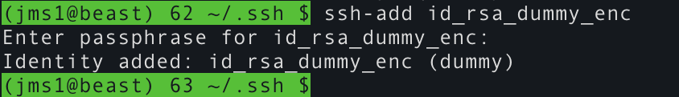
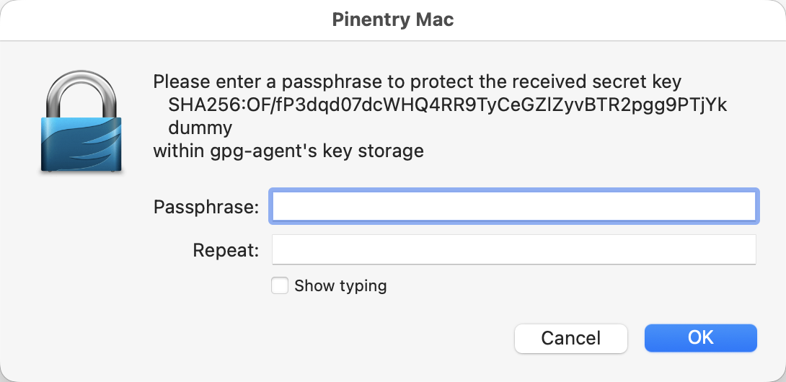
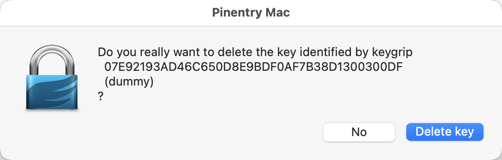
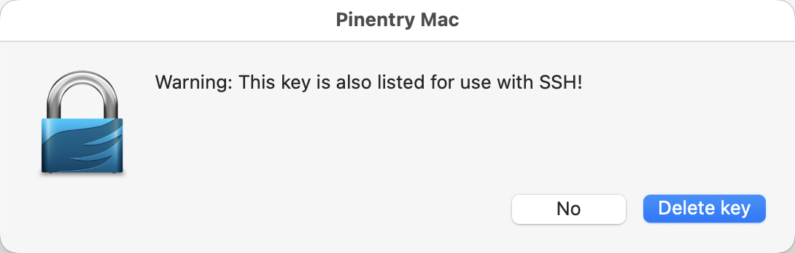

# Make SSH Use `gpg‑agent` Instead of `ssh‑agent` <!-- using non-breaking hyphens, mdbook doesn't render them within backticks -->

This page contains information about how to make `ssh`, `scp`, `sftp`, and other commands which speak the SSH Agent protocol, plus other commands which *use* `ssh` and friends (such as `git`, `rsync`, or Thunderbird), use `gpg-agent` instead of `ssh-agent`.

The primary reason for doing this would be if your SSH secret keys are physically [stored on a Yubikey](../../yubikey/ssh.md) or a [OpenPGP card](https://en.wikipedia.org/wiki/OpenPGP_card)-compatible smartcard.

> &#x2139;&#xFE0F; **GNUPGHOME**
>
> In some places below, you will see references to a `GNUPGHOME` environment variable.
>
> * If this variable exists, it tells `gpg` where to find its configuration, keyring, cache, and other files. Changing the `GNUPGHOME` variable allows you to easily use different sets of PGP keys.
> * If this variable does not exist, `gpg` will use `$HOME/.gnupg/` by default.
>
> You will also see `${GNUPGHOME:-$HOME/.gnupg}` in examples. For `bash` and many other shells, this means "if `GNUPGHOME` exists, use its value, otherwise use `$HOME/.gnupg`". If you're using a shell which doesn't handle variable expansions the same way, you may need to manually adjust some commands rather than copy/pasting them.


## Setup

The setup procedure is a bit different depending on which operating system you're using. Rather than try to explain it here, I split it off into separate pages.

* [Setup - macOS](macos.md) - I *know* this is working, it's what I use myself.
* [Setup - Linux](linux.md) - This *should* be working, but I don't use Linux as a workstation enough to be sure.
* Setup - ms-windows - I can't help you. I haven't voluntarily used ms-windows since 2002, and the most I remember is preferring "windows 2000" over "windows XP" because XP's eye-candy was ... eXtra Painful. And from what I've seen, it's only gone downhill since then.


## Make Sure It Worked

Once you've gone through the setup process above, you should find that ...

* The `SSH_AUTH_SOCK` environment variable points to the `S.gpg-agent.ssh` socket, either directly or indirectly.

    **On macOS**, `SSH_AUTH_SOCK` will point to a `/var/run/com.apple.launchd.xxxxxx/Listeners` file. Assuming you're using the setup procedure linked above, *that file* will be a symbolic link to the `S.gpg-agent.ssh` socket, instead of being a UNIX socket.

    ```
    $ echo $SSH_AUTH_SOCK
    /var/run/com.apple.launchd.eT5Z18IJi4/Listeners
    $ ls -l $SSH_AUTH_SOCK
    lrwxr-xr-x@ 1 jms1  wheel  34 Mar 26 14:18 /var/run/com.apple.launchd.eT5Z18IJi4/Listeners -> /Users/jms1/.gnupg/S.gpg-agent.ssh
    ```

* `gpg-agent` is running, listening on the `S.gpg-agent.ssh` socket.

    ```
    $ lsof -nP ${GNUPGHOME:-$HOME/.gnupg}/S.gpg-agent.ssh
    COMMAND     PID USER   FD   TYPE             DEVICE SIZE/OFF NODE NAME
    gpg-agent 10221 jms1    6u  unix 0xeed0f5322e7e0b39      0t0      /Users/jms1/.gnupg/S.gpg-agent.ssh
    ```

Assuming these are both true, you shouldn't need to *do* anything differently. You can use `ssh`, `scp`, `sftp`, or whatever, the same way you already do. As long as ...

* Your SSH client works with an agent, and finds that agent using the `SSH_AUTH_SOCK` environment variable (I've seen a few programs that claim to work with an SSH agent, but need to be configured to *find* the agent using some other mechanism, like a config file. Bad design decision on their part.)
* Your YubiKey is physically plugged into the computer
* An SSH secret key is [stored in the YubiKey](../../yubikey/load-pgp-key.html)

... it should "just work", the same as if the SSH secret key were stored on disk. The only difference is, instead of being asked for a passphrase, you may be asked for your YubiKey's PIN.


## SSH Agent Forwarding

SSH Agent Forwarding allows processes running on a remote machine that you're SSH'd into, to forward authentication requests back to an SSH Agent process (normally `ssh-agent`, but for our purposes `gpg-agent`) running on your local machine. The `gpg-agent` process handles these requests the same way it handles requests from processes (like `ssh`) running on the local machine - it forwards the request to the YubiKey, which uses the secret key stored in its "secure element" chip to calculate the correct answer.

Or to put it more simply ... **SSH Agent Forwarding allows you to SSH from one remote machine to another, without having to enter any passwords.**

Another *huge* advantage is this: Agent Forwarding means you don't have to store copies of your SSH secret keys on any remote servers. And if your secret key is [stored on a YubiKey](../../yubikey/ssh.md), you don't need to store the secret key on your local workstation either.

Assuming things are working correctly and your public key is already in your user's `$HOME/.ssh/authorized_keys` files on the remote machines, you could do something like this:

* On the local workstation, SSH into a remote machine called `alfa`.

    ```
    (user@local) $ ssh user@alfa
    ```

    There will be a prompt for the YubiKey's PIN, unless you've already entered it and the YubiKey is still "unlocked". After this, the YubiKey handles the authentication challenge and you're able to log into `alfa`.

    So far this is the normal SSH public-key authentication process. and "agent forwarding" isn't involved.

* On `alfa`, SSH into another machine called `bravo`.

    ```
    (user@alfa) $ ssh user@bravo
    ```

    This is where "agent forwarding" happens.

    * `sshd` on `bravo` generates a challenge and sends it back to `ssh` on `alfa`.
    * `ssh` on `alfa` *forwards* that challenge back to `ssh` on the local workstation.
    * `ssh` on the local workstation forwards the challenge to `gpg-agent`, who hands it to the Yubikey, who answers it.
    * The response is returned to `ssh` on `alfa`, who returns it to `sshd` on `bravo`.
    * Access is granted, and you're now logged into `bravo`.

* On `bravo`, SSH into another machine called `charlie`.

    ```
    (user@bravo) $ ssh user@charlie
    ```

    The same agent forwarding process happens, but instead of "`bravo` &#x2192; `alfa` &#x2192; local", it's "`charlie` &#x2192; `bravo` &#x2192; `alfa` &#x2192; local".

Being able to "hop" from one server to another, without having to store secret keys on the intermediate servers, is one of the best reasons to use SSH agent forwarding.

The same agent forwarding mechanism is used to access git repos *from* a remote machine, when the repo is accessed using SSH, i.e. if the URL is something like `ssh://server/repo` or `git@github.com:user/repo`.


### Using SSH Agent Forwarding

To use SSH Agent Forwarding ...

* For a single connection:

    * Use the `-A` option in your `ssh` commands, like so:

        ```
        ssh -A user@server
        ```

* For all connections to a single hostname:

    * In your `$HOME/.ssh/config` file, find or add a `Host` section for that hostname and add `ForwardAgent yes` below it.

        ```
        Host xyzzy
            ForwardAgent    yes
        ```

* For all connections to ALL hosts:

    * In your `$HOME/.ssh/config` file, find or add a `Host *` section and add `ForwardAgent yes` below that.

        ```
        Host *
            ForwardAgent    yes
        ```

    > &#x2757;&#xFE0F; **Must be the LAST `Host` section**
    >
    > If your `$HOME/.ssh/config` file has a `Host *` section, it MUST be the last `Host` section in the file.

If you have enabled SSH agent forwarding and need to disable it ...

* For a single connection:

    * Use the `-a` option in your `ssh` commands, like so:

        ```
        ssh -a user@server
        ```

* For all connections to a single hostname:

    * In your `$HOME/.ssh/config` file, find or add a `Host` section for that hostname and add `ForwardAgent no` below it.

        ```
        Host xyzzy
            ForwardAgent    no
        ```

* For all connections to ALL hosts:

    * In your `$HOME/.ssh/config` file, find or add a `Host *` section and add `ForwardAgent no` below that.

        ```
        Host *
            ForwardAgent    no
        ```

Note that the command line options will override anything in the config file.


## Creating `$HOME/.ssh/authorized_keys` Files

To set up the `authorized_keys` file on a machine that you'll be SSH'ing into (i.e. a machine which *isn't* the one with the YubiKey plugged into it) ...

**On your local machine** (the machine with the YubiKey plugged into it, which is presumably in front of you) ...

* Make sure the YubiKey is plugged in, and make sure things are set up correctly on the local machine.

    ```
    $ ssh-add -L
    ssh-rsa AAAAB3NzaC1yc...9toFRmxejrbw== cardno:0006xxxxxxxx
    ```

    The comment at the end will contain the serial number of your YubiKey. This tells you that your local machine is using `gpg-agent`, and that it is talking to the YubiKey correctly. If you don't see this, STOP and figure out why not.

* Use the `ssh-copy-id` command to install the public key on a remote machine.

    ```
    $ ssh-copy-id user@server.domain.xyz
    ```

    If your public key isn't already installed in that user's `authorized_keys` file on the remote machine, you may be prompted for your password on the remote machine.

* SSH into that machine, making sure that [agent forwarding](#ssh-agent-forwarding) is enabled.

    > &#x2753; **You should not be prompted for a password.**

**Make sure it works.** On the remote machine (the one you just SSH'd into)

* Run "`ssh-add -L`". If agent forwarding is working, it should show the SSH public key from your YubiKey.

    ```
    $ ssh-add -L
    ssh-rsa AAAAB3NzaC1yc...9toFRmxejrbw== cardno:0006xxxxxxxx
    ```

    This tells you that agent forwarding is working. If you don't see this, STOP and figure out why agent forwarding isn't working.

* If you like, you can edit the `$HOME/.ssh/authorized_keys` file (on the remote machine) and change the comment at the end of the line. If you do this, be careful not to change anything other than the comment.

    ```
    # OLD
    ssh-rsa AAAAB3NzaC1yc...9toFRmxejrbw== cardno: 12_345_678
    ```
    ```
    # NEW
    ssh-rsa AAAAB3NzaC1yc...9toFRmxejrbw== jms1@jms1.net 2019-03-21 hardware token
    ```

    I sometimes do this on machine where multiple SSH keys are listed in the `authorized_keys` file, to make it easier to tell which key is which.

If you need to set up an `authorized_keys` file by hand, make sure the files' permissions are correct.

* The remote user's home directory MUST be owned by that user, and MUST NOT have permissions allowing write access to any other groups or users.
* The `.ssh` directory MUST be owned by that user, and MUST NOT have permissions allowing ANY access to other groups or users.
* The `authorized_keys` file MUST be owned by that user, and MUST NOT have permissions allowing write access to any other groups or users. It also should not be executable.
* These two commands are what I use to "fix" the permissions.

    ```
    chown -R "$(id -u):$(id -g)" "$HOME/.ssh"
    chmod -R a+X,go= "$HOME/.ssh"
    ```

## Adding Other SSH Keys to the Agent

There may be cases where you need to use multiple SSH keys for accessing different servers, and not all of the keys are stored on YubiKeys.

SSH secret keys which are stored in files on the disk (such as `id_something`, without `.pub` at the end) can be added to `gpg-agent` using the same `ssh-add` command you would use with `ssh-agent`.

```
ssh-add ~/.ssh/id_xxx
```

However, there are a few things to be aware of.

* `ssh-add` sends the actual secret key data to `gpg-agent` over the same socket that `ssh` and friends use to request authentication processing. (It uses a different message type.) The `gpg-agent` process does not read, or even *know*, the filename that `ssh-add` is reading from.

* Because of this, `gpg-agent` **stores its own COPIES of the secret keys.**

* It stores the secret keys in files under the `$GNUPGHOME/private-keys-v1.d/` directory. When `gpg-agent` needs to use one of these keys to answer an authentication request, it reads them from its own storage, rather than from whatever file `ssh-add` originally read the secret key from.

* The files are named using the "key grip", which is another kind of fingerprint.

* These files contain the secret key data, encrypted using passphrases which may be different than the passphrases on the original SSH secret key files they were imported from. (You *can* use the same passphrases if you like.)

* When you add a key from an SSH secret key file having a passphrase, there will be multiple passphrase prompts. **Read the passphrase prompts carefully.**

    * The first prompt is for the existing passphrase for the file containing the secret key. If that file doesn't have a passphrase, you will not be prompted for one.

        This prompt is generated by `ssh-add` itself, so it may appear on the command line, like this:

        

        Notice that the prompt is asking for the `passphrase for id_rsa_dummy_enc`.

    * The second prompt is for a new passphrase to encrypt the file in the `private-keys-v1.d/` directory.

        This prompt is generated by `gpg-agent`, so it will probably be a pop-up window, like this:

        

        Notice that the prompt explains that the passphrase is "to protect the received secret key XXX within gpg-agent's key storage". (That `SHA256:OF/f...TjYk` blob in the middle is not the secret key, it's a *hash* of the secret key.)

    * If the second prompt didn't have two input fields, there may be a third prompt asking you to verify the new passphrase.

* Once the `private-keys-v1.d/` file is written, any time `gpg-agent` prompts you for a passphrase in order to *use* the key, you will need to enter the "new passphrase" rather than the original one.

When `gpg-agent` uses a key stored in a `$GNUPGHOME/private-keys-v1.d/` file to process an SSH authentication request, it holds the SSH secret key in memory for a limited amount of time, and then deletes it from memory.

* The default and maximum cache times can be configured using the `default-cache-ttl-ssh` and `max-cache-ttl-ssh` directives in the `$GNUPGHOME/gpg-agent.conf` file. See the `gpg-agent(1)` man page (i.e. run `man 1 gpg-agent`) for more details.

* These settings do not affect keys stored in a YubiKey/PGPCard. The secret keys are never cached, because they are never present in `gpg-agent` to begin with.

If you get curious and inspect the files in the `$GNUPGHOME/private-keys-v1.d/` directory, you will find that they contain one of ...

* A `private-key` element, if the file contains a secret key *without* a passphrase.
* A `protected-private-key` element, if the file contains a secret key *with* a passphrase.
* A `shadowed-private-key` element, if the file contains the serial number of a YubiKey/PGPCard *containing* the secret key.


## Removing SSH Keys from `gpg-agent`

One problem with `gpg-agent` is that it does not support deleting keys via the SSH Agent protocol. This means that the `ssh-add -d` (or `-D`) command will not remove keys from `gpg-agent`.

### Stored on a YubiKey

If the secret key is stored on a YubiKey, **unplug the YubiKey**. That's all there is to it.

`gpg-agent` will remember the serial number of the card *containing* the secret key, but that's harmless. It won't remember the secret key itself, because it never *has* the secret key to begin with.

#### Totally Forget the Key

The file containing the serial numbers are harmless on their own, although they could be used to prove that a paraticular YubiKey/PGPCard *was* plugged into the computer at some point.

If this is an issue and you need to make `gpg-agent` totally forget that the keys on that YubiKey ever existed ...

* Use `gpg --card-status --with-keygrip` to get the keygrips of the PGP keys stored on that YubiKey.

    ```
    $ gpg --card-status --with-keygrip
    Reader ...........: Yubico YubiKey FIDO CCID
    Application ID ...: D2760001240100000006199999990000
    Application type .: OpenPGP
    Version ..........: 3.4
    Manufacturer .....: Yubico
    Serial number ....: 19999999
    ...
    Signature key ....: 77DE BB0C 8C7F BAFF 1E0E  70DC E9E4 4ED3 0E2F 2445
          created ....: 2019-03-21 19:40:23
          keygrip ....: DF5571AFEE0E2A27263ACBE4B01EDCD32DB1A000
    Encryption key....: 3C8E C9C7 B067 A4C5 42F9  727D 795C 2CF8 2436 4755
          created ....: 2019-03-21 19:40:11
          keygrip ....: B384E95E0EC2599ECA8BE528FA867C812F114591
    Authentication key: 7A6B 95B6 BF89 7A64 9716  5AE4 3682 3233 F8D0 9EB7
          created ....: 2019-03-21 19:40:33
          keygrip ....: 4F2C05E90C31510A194744D3F836149F74D1AE6F
    ...
    ```

    In this case, the YubiKey has three subkeys, with the following keygrips:

    * `DF5571AFEE0E2A27263ACBE4B01EDCD32DB1A000`
    * `B384E95E0EC2599ECA8BE528FA867C812F114591`
    * `4F2C05E90C31510A194744D3F836149F74D1AE6F`

* Under the `$GNUPGHOME/private-keys-v1.d/` directory, delete the files whose names start with those keygrips.

Note that the next time `gpg-agent` "sees" that YubiKey/PGPCard, it will create these files again.


### Loaded from a File

If you need to delete a secret key that was originally loaded from a file (using `ssh-add`), the secret key will be stored in one of the files under the `$GNUPGHOME/private-keys-v1.d/` directory.

To delete the key from `gpg-agent`'s key storage ...

* Get the fingerprint of the key you want to delete.

    * Use `ssh-add -l` to get a list of all SSH keys the agent knows.

        ```
        $ ssh-add -l
        4096 SHA256:l7CsDA23ENutkRsZ5jhlqJfl2syaiJfHni7b95e8dQ4 cardno:19_999_999 (RSA)
        4096 SHA256:OF/fP3dqd07dcWHQ4RR9TyCeGZlZyvBTR2pgg9PTjYk dummy (RSA)
        ```

    * Identify the key you want to delete. In this example we're deleting the "dummy" key, the one whose description does *not* start with `cardno:`.

    * Remember its fingerprint, in this case `SHA256:OF/fP3dqd07dcWHQ4RR9TyCeGZlZyvBTR2pgg9PTjYk`.

* Use `gpg-connect-agent` to get a list of all SSH keys the agent knows, with their keygrips.

    ```
    $ gpg-connect-agent 'keyinfo --ssh-list --ssh-fpr' /bye
    S KEYINFO 07E92193AD46C650D8E9BDF0AF7B38D1300300DF D - - - P SHA256:OF/fP3dqd07dcWHQ4RR9TyCeGZlZyvBTR2pgg9PTjYk - S
    OK
    ```

* Find the keygrip. This is the long number immediately after `KEYINFO`, on the same line with the fingerprint you saw in the `ssh-add -l` output.

    In this example ...

    * `SHA256:OF/fP3dqd07dcWHQ4RR9TyCeGZlZyvBTR2pgg9PTjYk` is the fingerprint from the `ssh-add -l` output above.
    * `07E92193AD46C650D8E9BDF0AF7B38D1300300DF` is the "key grip".

    Note that this command will not show key grips for keys stored on a YubiKey or PGPCard.

* Tell the agent to delete the key.

    ```
    $ gpg-connect-agent 'delete_key 07E92193AD46C650D8E9BDF0AF7B38D1300300DF' /bye
    OK
    ```

    When you enter the command, you will get a pop-up dialog asking you to confirm that you want to delete the key:

    

    When you click "Delete" key, a second pop-up will appear, warning you that the key is flagged for SSH.

    

    When you click "Delete key" on both of these, the secret key will be deleted.

* This deletes the `$GNUPGHOME/private-keys-v1.d/xxx.key` file containing the encrypted key, which is enough to prevent the key from being used.

    ```
    $ ssh-add -l
    The agent has no identities.
    $ cd ${GNUPGHOME:-$HOME/.gnupg}/private-keys-v1.d/
    $ ls -la 07E92193AD46C650D8E9BDF0AF7B38D1300300DF*
    ls: 07E92193AD46C650D8E9BDF0AF7B38D1300300DF*: No such file or directory
    ```

    However, it does *not* remove the key grip from the `$GNUPGHOME/sshcontrol` file, which means that `gpg-agent` will still have a record that a secret key with that grip *existed* at one point.

    ```
    $ cd ${GNUPGHOME:-$HOME/.gnupg}/
    $ cat sshcontrol
    # List of allowed ssh keys.  Only keys present in this file are used
    ...
    # RSA key added on: 2026-04-03 09:46:59
    # Fingerprints:  MD5:13:e7:40:70:aa:f7:49:ab:86:71:b5:72:7d:46:3b:85
    #                SHA256:OF/fP3dqd07dcWHQ4RR9TyCeGZlZyvBTR2pgg9PTjYk
    07E92193AD46C650D8E9BDF0AF7B38D1300300DF 0
    ```
    ```
    $ gpg-connect-agent 'keyinfo --ssh-list --ssh-fpr' /bye
    S KEYINFO 07E92193AD46C650D8E9BDF0AF7B38D1300300DF - - - - - - - S
    OK
    ```

    **If you want to remove *all* record of the key grip**, edit the `$GNUPGHOME/sshcontrol` file and remove the line starting with that key grip, plus the comments immediately above it.

    As I mentioned above, if this is the only key grip in the file, you can remove the file. The next time `gpg-agent` does anything relating to SSH, it will create a new `sshcontrol` file containing *just* the comment at the top of the file.
