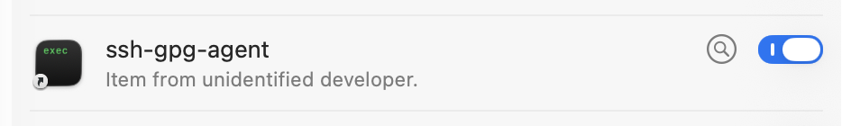

# Setting up SSH to use `gpg-agent` on macOS

These directions will configure your user account on the machine so you don't have to manually do anything after logging in, other than remembering to plug in your YubiKey.


## Background

> &#x2139;&#xFE0F; Feel free to skip this part if you like.

In macOS, a "LaunchAgent" is a configuration which starts a process or runs a command automatically, when a *user* logs in. These are different from a "LaunchDaemon", which starts a process or runs a command when the system boots, regardless of which user logs in (or *if* a user logs in).

Part of macOS is a LaunchAgent which does the following, every time a user logs in:

* Creates a UNIX socket with a dynamic name, and sets things up so that `ssh-agent` is automatically started, listening on on that socket, the first time a process connects to the socket. (If multiple users are logged in, each user will have their own socket and their own `ssh-agent` process.)

* Exports an `SSH_AUTH_SOCK` environment variable whose value is the path to that dynamically generated socket. Every new process started by that user inherits this environment variable.

    This environment variable is used by `ssh`, `scp`, `sftp`, and other commands, to find the UNIX socket it uses to talk to an SSH agent. This is normally the `ssh-agent` process that `launchd` starts, the first time a client connects to the socket.

**We need to change things around so that the `SSH_AUTH_SOCK` variable points to a UNIX socket where `gpg-agent` is listening.**

My original idea was to change the value of the `SSH_AUTH_SOCK` variable itself. I did figure out how to do this automatically when the user logs in, by disabling or removing the built-in LaunchAgent which runs `ssh-agent`. However, OS X 10.11 "El Capitan" and later introduced some security measures which make this difficult, or (starting with macOS 11 "Big Sur") impossible.

While I was hunting for information about how to disable this LaunchAgent in macOS 10.15 "Catalina", I found [this article](https://evilmartians.com/chronicles/stick-with-security-yubikey-ssh-gnupg-macos) which explained a different way to solve the problem. Instead of disabling the macOS LaunchAgent (which we cannot do in macOS 11 and later), we can replace the UNIX socket that `launchd` sets up, with a [symbolic link](https://en.wikipedia.org/wiki/Symbolic_link) (or "symlink") to the UNIX socket where `gpg-agent` is listening for SSH agent requests.

This way, any client which uses the `SSH_AUTH_SOCK` value to connect to an SSH agent, follows the symlink and ends up actually talking to `gpg-agent` instead.

The other thing is, we need to create this symlink every time the user logs in. The simplest way to do this is using a per-user LaunchAgent, since they run every time the user logs in.

This depends on the system LaunchAgent being run *before* our new LaunchAgent, since the new LaunchAgent needs the name of the UNIX socket created by the system LaunchAgent.

> It *looks like* `launchd` always processes the system LaunchAgents before user LaunchAgentsgit status
, but I haven't seen any official documentation which says that. While I've never seen it happen, I'm not totally convinced that the new LaunchAgent won't accidentally run *before* the system LaunchAgent.


## Older OS/X or macOS Versions

The process below works with macOS 26. It *should* also work with earlier macOS versions, however it requires installing packages from Homebrew, which is currently removing support for older macOS versions. See [this page](https://docs.brew.sh/Support-Tiers) for more details.

If you're using an older OS/X or macOS version for which Homebrew is not available, you'll have to find other ways to install GnuPG and a "pinentry" program. Possible options (which I have not tested, or used in several years) include ...

* [GPGTools](https://gpgtools.org/) has a macOS package containing GnuPG. It includes `gpg` and other command line tools, plus some GUI tools. (I don't know if this includes a "pinentry" program.)

    It also comes with a Mail.app plugin that needs to be paid for if used for more than 30 days. From what I remember, payment is not required if you're not using the Mail.app plugin.

    Their web site says it supports macOS 10.15 "Catalina" and later.

* [MacPorts](https://www.macports.org/) is another package manager that you might use instead of Homebrew.

    Installers for the latest version ([MacPorts 2.12.5](https://github.com/macports/macports-base/releases/tag/v2.12.5), as of 2026-07-25) are available for OS/X 10.5 "Leopard" through macOS 26 "Tahoe".

    Thier web site says that most of the packages they install, target macOS 13 "Ventura" and later.

* [Fink](https://www.finkproject.org/) is another possible alternative to Homebrew. Their web site looks like it hasn't been updated in a while, it currently (2026-07-25) says they're "working on" support for macOS 11-13. It looks like the packages that Fink *installs* are still being updated.

The final option, as always, is to compile the software from source, using a version of XCode which supports your OS/X or macOS version.

* [GnuPG](https://gnupg.org/)
* [pinentry-mac](https://github.com/GPGTools/pinentry)

I mention this because I own several older Macs which still physically work just fine, even though nobody is writing or updating software for them anymore. (If you're curious, the oldest working machine is a Titanium PowerBook G4.)


## Pre-requisites

These steps need to be done once for each machine.

* Install [Homebrew](https://brew.sh/).

    Homebrew is a "package manager" for macOS, similar to systems like `yum` or `apt` for Linux. It makes installing other software a LOT easier.

    ```
    /bin/bash -c "$(curl -fsSL https://raw.githubusercontent.com/Homebrew/install/HEAD/install.sh)"
    ```

* Install the `gnupg` and `pinentry-mac` Homebrew packages.

    ```
    brew install gnupg pinentry-mac
    ```

* Configure `gpg-agent`.

    ```
    mkdir -p $HOME/.gnupg
    cat > $HOME/.gnupg/gpg-agent.conf <<EOF
    enable-ssh-support
    pinentry-program        $( which pinentry-mac )
    EOF
    ```


## Manual Process

The following things need to be done every time you log into the Mac.

* Configure `gpg-agent`.

    * Get the full path to the `pinentry-mac` executable.

        ```
        which pinentry-mac
        ```

        You may need this in the next step.

    * Check the `${GNUPGHOME:-$HOME/.config}/gpg-agent.conf` file. It should contain the two lines listed in the [Pre-requisites](#pre-requisites) section above.

        ```
        enable-ssh-support
        pinentry-program        /path/to/pinentry-mac
        ```

    * If `gpg-agent` is running, restart it.

        ```
        gpg-connect-agent killagent /bye
        gpg-connect-agent /bye
        ```

* Set up the `SSH_AUTH_SOCK` symlink.

    * Make sure the `SSH_AUTH_SOCK` variable is not empty.

        ```
        echo "$SSH_AUTH_SOCK"
        ```

        It will normally point to a `/var/run/com.apple.launchd.xxxxxx/Listeners` file.

    * Create or fix the `SSH_AUTH_SOCK` symlink.

        ```
        rm -f "$SSH_AUTH_SOCK"
        ln -s "${GNUPGHOME:-$HOME/.gnupg}/S.gpg-agent.ssh" "$SSH_AUTH_SOCK"
        ```


## Automated Process

I've written a script called `ssh-gpg-agent` which automates the manual process above.

It *can* also create a "Launch Agent" which runs the script when you first log in.

> &#x2139;&#xFE0F; **Why create a LaunchAgent?**
>
> You might think that adding a line to your `.bashrc` file which runs the script, would solve the problem. You would be *close*, but not entirely correct.
>
> The `.bashrc` file is processed *when an interactive shell starts*. This means when you first log into your Mac, the `.bashrc` file isn't processed until you start a Terminal (or in my case, [iTerm2](https://iterm2.com/)) session, and then it's processed again every time you open a new shell in a new window or tab.
>
> **LaunchAgents are "Login Items"**, which are executed *one time*, as part of the login process, without the user having to do anything. This is the same mechanism used by a lot of other programs which start automatically when you log in. If you install a LaunchAgent, you will see it in the list of Login Items, in the System Preferences app, and can disable it there if needed.
>
> 


### Download and install the script

* [Download the `ssh-gpg-agent` script](../../scripts/ssh-gpg-agent). Save it in a directory which is in your `PATH`.

    * I use `$HOME/bin/` for this, since my `.bashrc` already adds this directory to my `PATH`. Another commonly used directory for this is `$HOME/.local/bin/`. It doesn't really matter where you store it, as long as it's in your `PATH` so you can run it by hand when needed.

* Make sure the file is marked as executable.
    ```
    chmod 0744 "$HOME/bin/ssh-gpg-agent"
    ```

### Using the script

Once the script is installed, there are three ways to run it.

* Running the script with no options will configure `gpg-agent` and set up the `SSH_AUTH_SOCK` symlink, as explained above.

* Running the script with the `-i` option will install a LaunchAgent which runs the script as part of the login process.

* Running the script with the `-r` option will remove the LaunchAgent, if that becomes necessary. Note that this will *not* undo the symlink change or "un-configure" `gpg-agent` - it just means that the next time you log in, the script's changes (primarily the symlink change) will not happen, and *that* login session will use `ssh-agent` (unless you run the script by hand, of course).

* Running the script with the `-h` option will show a list of the other options the script supports.

There is also a `-l` option which lets you specify a log file where the script will record what it's doing. If you combine this with the `-i` option, the installed LaunchAgent will record *its* activities to that log file.

```
ssh-gpg-agent -il "$HOME/ssh-gpg-agent.log"
```

Note that the LaunchAgent (the `$HOME/Library/LaunchAgents/net.jms1.ssh-gpg-agent.plist` file) will contain the full path to wherever you installed the script. If you need to move it later, remove and re-add the LaunchAgent.


## Test

If you already have a YubiKey with an SSH key loaded, you should verify that things are working.

* If you installed the LaunchAgent, log out and log back into your Mac. Rebooting will also accomplish this.

* Open a shell (Terminal, iTerm2, etc.)

* If you *didn't* install the LaunchAgent, run the script with no options.

* If the SSH key stored on the YubiKey is also stored in `id_xxx` files, move them to a different directory for now. Once the test is working and you're comfortable with it, you can remove that other directory so the secret key isn't present on the machine at all (which is, after all, the whole point of storing your secret keys on a YubiKey to begin with).

    ```
    $ mkdir ~/hold-keys
    $ mv -v ~/.ssh/id_* ~/hold-keys/
    $ chmod -R go= ~/hold-keys/
    ```

* With the YubiKey NOT inserted, make sure the SSH agent doesn't see any keys. (In this command, `-l` is a lowercase "L", not the digit "one".)

    ```
    $ ssh-add -l
    The agent has no identities.
    ```

    If there are any keys on the list, they will be keys loaded from `id_xxx` files.

* Insert the YubiKey, and make sure the agent DOES see the key stored on the YubiKey. (In this command, `-l` is a lowercase "L", not the digit "one".)

    ```
    $ ssh-add -l
    4096 SHA256:l7CsDA23ENutkRsZ5jhlqJfl2syaiJfHni7b95e8dQ4 cardno:19_999_999 (RSA)
    ```

    If there were any keys on the first list (with the YubiKey unplugged), the same keys will be present on the second list. What you're looking for is the key whose comment starts with `cardno:` ... it *should not* be there when the YubiKey is unplugged, and it *should* be there when the YubiKey is plugged in.

You may notice that the SSH public key doesn't have the same "comment" that you might normally see after a key. The YubiKey only stores the *secret* key, and the public key is derived from that. It doesn't store any kind of metadata about the key. The comment it shows will contain the serial number of the YubiKey.

