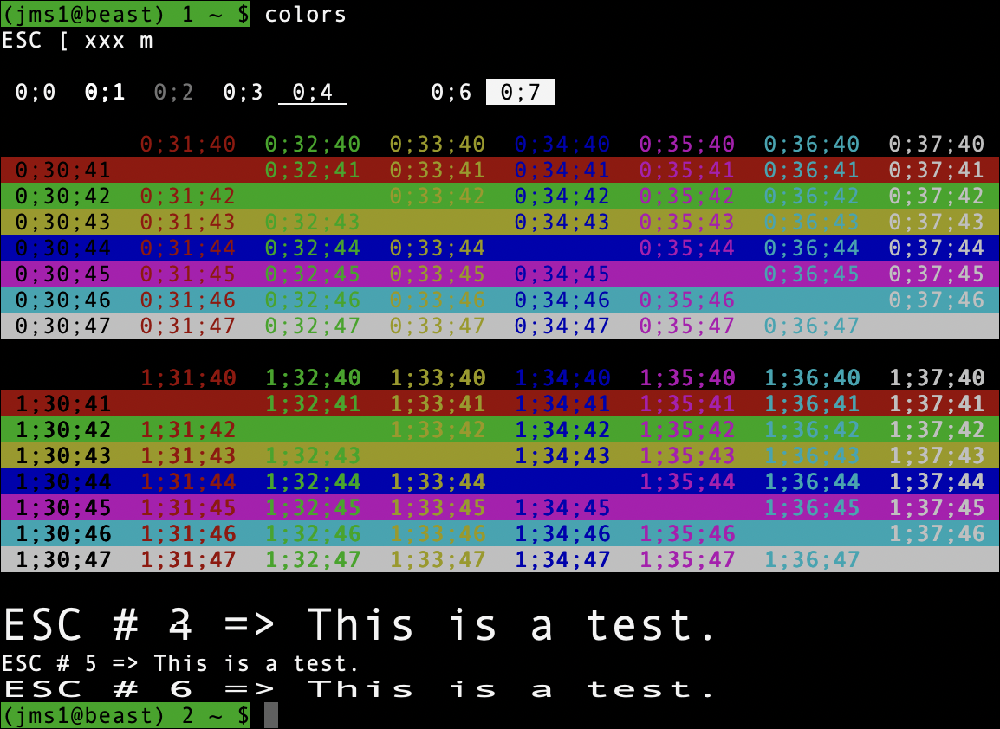
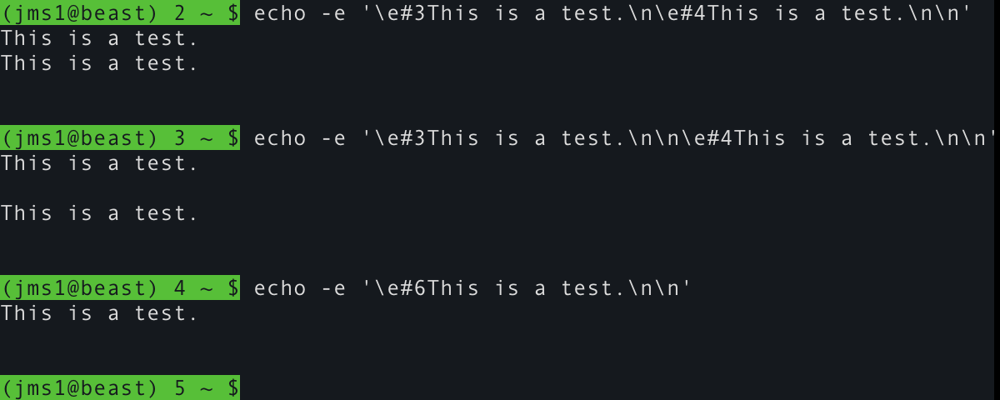

# Colors

This is a script I threw together as a quick way to see what different ANSI colour combinations look like on whatever terminal I'm using at the moment.

*(Screenshot from Apple `Terminal.app` under macOS 26.0.1)*

### Download

&#x21D2; [`colors`](colors)

## Control Sequences

Most of the values you're seeing above are used as part of an ANSI Control Sequence (these are also known as [ANSI escape codes](https://en.wikipedia.org/wiki/ANSI_escape_code)). These are sequences of control characters which, when "printed" to a terminal, control the terminal's behaviour. In the case of the `colors` script, they control the colour used to draw the characters sent *after* the control sequence.

These control sequences were originally used by the [DEC VT-100 terminal](https://vt100.net/shuford/terminal/dec.html) (which I used in high school. The computer lab had several different kinds of terminals, but I preferred the VT-100's because of how the keyboard "felt" under my fingers.

> This is the first time I remember thinking about how keyboards *feel*, and was the beginning of what made me prefer mechanical keyboards to this day.

A "control sequence" is just a specific set of characters, sent to the terminal, by the "host" it's connected to. In most cases (these days), the terminal is a window on your desktop, and the host is either the computer in front of you, or a computer that you may be connected to remotely (via SSH, for example).

These characters are ...

* `ESC` is the ANSI "ESC" control character, ASCII 27 or `0x1B`.

    The C `printf()` function uses the notation `\e` to represent this character. Many other languages and utilities (including `echo -e`) use the same notation. I'll be using the same notation below.

* The sequence `\e[` (i.e. `ESC` followed by `[`) tells the terminal that an ANSI control sequence is starting. Some documentation will refer to this sequence as `CSI`, which means "command sequence initiator".

* There may or may not be a sequence of numbers, separated by `;`.

* After the numbers will be a character that tells the terminal *which command* is being sent.

### Setting Text Attributes

The `\e[...m` command tells the terminal that any characters printed *after* the sequence, should be drawn using certain colours or other visual attributes. The numbers between `[` and `m` control what they should look like.

The numbers used to draw the first line are ...

* `0` means to reset the text back to "standard" colours, typically white text on a black background.
* `1` means to make the foreground colour "bold".
* `2` means to make the foreground colour "faint".
* `3` means to draw the text in italics.
* `4` means to draw the text with an underline.
* `5` means to make the text blink slowly.
* `6` means to make the text blink quickly.
* `7` means to draw the text in "reverse video", i.e. with the foreground and background colours reversed.
* `8` means to "conceal" the text. (What this actually *means* will depend on the terminal software.)
* `9` means to draw the text "crossed out", i.e. with a horizontal line through it.

Note that not all terminal programs *support* all of these codes. As an example, none of the terminal programs I use know how to make text blink. For the most part, terminal programs will ignore codes they don't understand. This is actually why I wrote the `colors` script, so I could quickly tell how different terminal programs handle different visual attributes.

### Setting Colours

Setting text colours uses the same `\e[...m` command shown above, but uses a different set of numbers to specify the colours.

* `30-37` set the foreground colour.
* `40-47` set the background colour.

### Setting Text Height and Width

The original VT-100 and later VT-series terminals were able to draw characters twice as high and/or twice as wide as normal. Not all terminals were (or are) able to do this, so the control sequences to show text this way are not part of the ANSI X3.41 standard. They are proprietary to DEC (Digital Equipment Corporation, who made the VT-series terminals), however some terminal emulation software also supports them.

Instead of starting with `ESC` `[`, these control sequences start with `ESC` `#`. In these sequences, the character after the `#` controls the sizes of *all characters on that line* rather than any *individual* characters on the line, which means you can't mix different character sizes within the same line.

In addition, double-height characters need to be drawn on two lines - one line containing the top half of each character, and the next line containing the bottom half.

The control sequences for this are ...

* `ESC` `#` `3` means that the characters on the current line should be drawn as the *top half* of double-height, double-width versions of those characters.
* `ESC` `#` `4` means that the characters on the current line should be drawn as the *bottom half* of double-height, double-width versions of those characters.
* `ESC` `#` `5` means that the characters on the current line should be drawn as "normal height, normal width" characters (i.e. the way they would normally be drawn anyway).
* `ESC` `#` `6` means that the characters on the current line should be drawn as double-width, but normal height, versions of those characters.

This is easier to understand when you can see it, so these screenshots show the difference between a terminal which *does* support these sequences (Apple `Terminal.app`), and a terminal which *does not* support them (iTerm2), both using "Andale Mono 13 Regular" as the font.

*(Screenshot from Apple `Terminal.app` v2.15(464) under macOS 26.0.1)*

*(Screenshot from iTerm2 v3.6.5 under macOS 26.0.1)*
