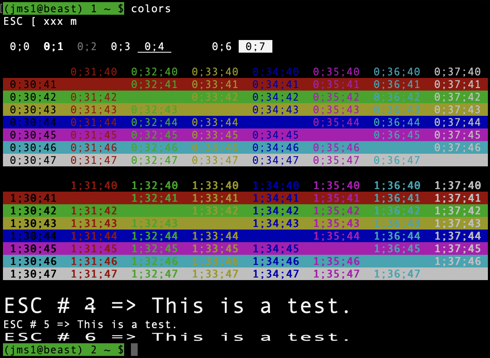

# Colors

This is a script I threw together as a quick way to see what different ANSI colour combinations look like on whatever terminal I'm using at the moment.

*(Screenshot from Apple `Terminal.app` under macOS 26.0.1)*

[Download](colors)
