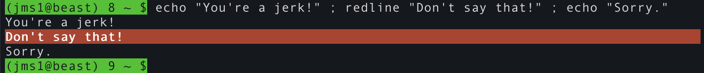
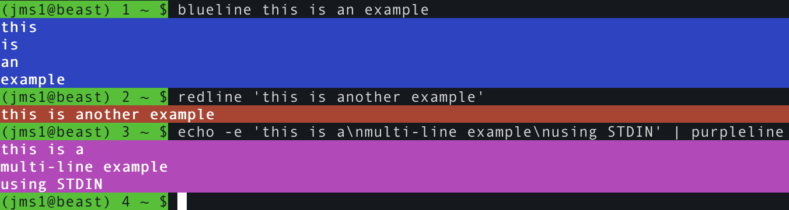

# Coloured line functions

This is a collection of shell functions which print coloured lines of text.

Coloured lines can make it easy to tell where a piece of text starts or ends.




### ANSI Control Sequences

These functions assume that your terminal handles ANSI control sequences, also known as [ANSI esecape codes](https://en.wikipedia.org/wiki/ANSI_escape_code). These are explained in more detail on the [Colors](colors.md) page.


## Functions

These could be stand-alone scripts, however I found it easier to write them as functions and `source` them into my shell when it starts.

The first function, `coloured_line`, does the heavy lifting. It requires one parameter, and *may* have more.

* The first parameter specifies the colour. This is a set of numbers and `;` characters which are inserted into the ANSI command sequence which sets the colour.

* If there *are* more parameters, they are essentially joined into a single string with newlines between them, and then *that* is split into lines. Each line is printed with the appropriate control sequences before and after the text of that line.

* If there *are no* more parameters, the function reads lines from STDIN and prints each one with the appropriate control sequences before and after the text of that line.

Joining the parameters and splitting the lines allows the caller to provide multiple lines, either as multiple parameters *or* as multi-line strings.

```bash
function coloured_line {
    local COL P IFS LINE LINES

    COL="${1:?no colour code specified}"
    shift

    if [[ -n "$1" ]]
    then
        ########################################
        # each parameter is a line

        for P in "$@"
        do
            IFS=$'\n' read -a LINES -d '' -r <<< "$P" || true
            for LINE in "${LINES[@]}"
            do
                printf "\e[%sm%s\e[0K\e[0m\n" "$COL" "$LINE"
            done
        done
    else
        ########################################
        # STDIN will contain one or more lines of text

        while IFS='' read -r LINE
        do
            printf "\e[%sm%s\e[0K\e[0m\n" "$COL" "$LINE"
        done
    fi
}
```

The other functions are wrappers around the `coloured_line` function. These specify the appropriate colour code and pass their input parameters (if any) along without modification. Note that the colour codes all start with `0;`, which resets the colour to the defaults. This ensures that the output won't "inherit" any attributes from whatever may have been active before.

```
function redline {
    coloured_line '0;1;37;41' "$@"
}

function yellowline {
    coloured_line '0;30;43' "$@"
}

function blueline {
    coloured_line '0;1;37;44' "$@"
}

function greenline {
    coloured_line '0;1;37;42' "$@"
}

function cyanline {
    coloured_line '0;1;37;46' "$@"
}

function purpleline {
    coloured_line '0;1;37;45' "$@"
}

function whiteline {
    coloured_line '0;1;37;47' "$@"
}
```

Examples



## Variations

These are different versions of the same functions. Depending on your needs, you may find these more useful.


### Simpler verions

These functions are simpler, but they may not handle multi-line strings correctly.

```bash
function redline {
    printf "\e[0;1;37;41m%s\e[0K\e[0m\n" "$*"
}
```

(not showing all colours)


#### Handle output when STDOUT is not a terminal

One thing to note is that the functions, as written above, will *always* print the codes to generate coloured lines. You *can* change them so that they only print the "colour codes" when run in a terminal, and print some kind of plain-text version, without the colour codes. As an example ...

```bash
function redline {
    if [[ -t 1 ]]
    then
        printf "\e[0;1;37;41m%s\e[0K\e[0m\n" "$*"
    else
        echo "***** $* *****"
    fi
}
```

## `fail` Function

In many of my scripts, when an error occurs I want to draw the user's eye to it. I do this using the `fail` function, which is pretty simple - it uses `redline` to print the message it received in a red line, then exits from the script.

This function is useful within scripts, but you probably *don't* want to include it in your `.bashrc` file. If you were to type `fail` in a shell, it would print the message and then immediately exit from the shell.

```
function fail {
    redline "$@"
    exit 1
}
```
