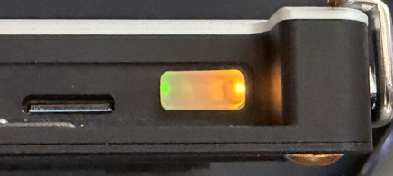
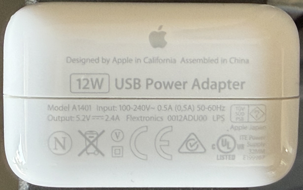
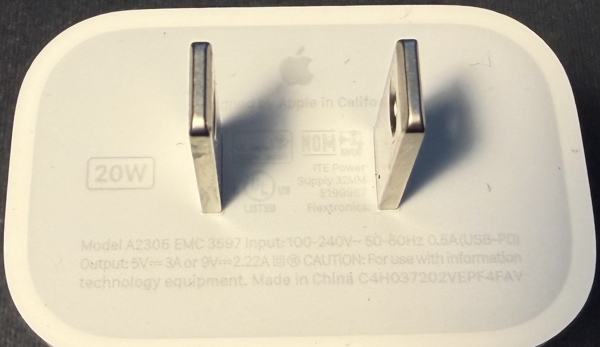
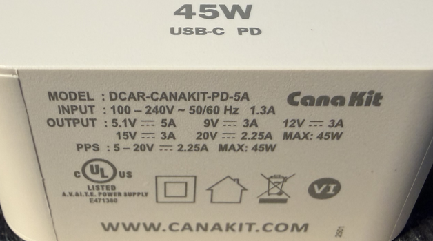

# Power

## Indicators

The uConsole comes with a translucent white rubber button for power. The button is translucent because there are two LEDs on either side of the button itself, which can be seen *through* the button:

* A green LED, which indicates that the uConsole's power is on.

* A yellow LED, which indicates that the uConsole is charging the internal batteries.

## Power Supply

The uConsole requires a 5V 2A power supply with a USB-C connector. The power supply can be used to charge the batteries, and can also be used to power the unit when batteries are not installed.

**A power supply is NOT included with the kit.** Most USB-C chargers for mobile phones or tablets should be usable with the uConsole, however ...

**The uConsole does not perform USB-PD power negotiation.** It expects the USB-C port to receive 5V power, and can draw *up to* 3A. The highest I've *seen* it draw is 1.8A, or 5W). Chargers which *only* supply 5V, or which *correctly* implement the [USB-PD](https://hackaday.com/2023/01/09/all-about-usb-c-power-delivery/) power negotiation process, should work with the uConsole.

What this means is, any USB power supply which only supplies 5V, or any *newer* power supply which can supply more but *correctly* implements USB-PD, should be usable with the uConsole. Be aware that some power supplies may not negotiate USB-PD correctly and can damage the uConsole, as [this forum post](https://forum.clockworkpi.com/t/20836) illustrates.

* This power supply (I *think* from an old iPad) only outputs 5V, up to 2.4 A. My uConsole works just fine with it.

    

* This power supply (from a newer iPad Pro) is the one I carry in the box with my uConsole. It can output 5V *or* 9V, up to 3A. It is marked as supporting USB-PD.

    

* This power supply came with a Raspberry Pi 5 kit. It isn't *explicitly* marked as supporting USB-PD, however the list of voltage levels is identical to the list of voltage levels supported by USB-PD. A quick test shows that it doesn't try to supply more than 5V to the uConsole, and the uConsole was able to charge the battery while plugged into it.

    

## Batteries

The uConsole is powered by a pair of 18650 rechargable Li-ion batteries. The battery holder within the unit can hold either flat-top or button-top batteries. The main board has the necessary circuitry to charge the batteries, so you don't have to remove them in order to recharge them.

The batteries are connected in parallel, which means that it *will* run with only a single battery installed. It also means that if you need to replace the batteries, you *could* theoretically swap them out one at a time while the system is running, however this is not recommended.

**Batteries are NOT included with the kit.** This is due to safety regulations around shipping lithium batteries.

You probably won't find these batteries in a normal retail store. I've seen them at a dedicated battery store, and apparently most "vape" shops sell them as well (apparently vape pens use them?) They can also be ordered from suppliers like Amazon or AliExpress, however you need to be careful not to order "fake" batteries which don't have the capacity they claim.

> &#x26A0;&#xFE0F; **Battery Capacity**
>
> **The physical and electrical characteristics of Li-ion batteries limit the capacity of a 18650 cell to about 3600 mAh**, with the "normal" capacity being 2500-3000 mAh. If you see batteries advertised with higher capacities (such as 5000 or 9900 mAh), be aware that the seller is probably lying about the capacity, and their claims should not be trusted.
>
> **I admit, I fell for this.** In 2025-01 I bought some batteries which were advertised as having 5000 mAh capacity, for a different device (an [Arpeggio](https://www.tangibleinstruments.com/) mini-synth, if you're curious). The batteries do work, however it was the first time I had ever used 18650 cells so I didn't realize that only two hours of run-time wasn't normal.
>
> I have since ordered a set of higher quality batteries (links below), with a charger that has a capacity tester function. The new batteries all test between 2890 and 2960 mAh, while the old ones that I tested only had 1380 and 1400 mAh. I have thrown the old batteries out.

### Calibration

When the batteries in the uConsole are changed, you may need to calibrate the power controller so it knows the maximum capacity of the new batteries and can calculate the right percentage to show in the on-screen battery indicator.

This is covered on the [Battery Calibration](battery-calibration.md) page.

## Links

### Batteries

* Amazon - [Authentic Samsung30Q, 3.7V Flat Top Real 3000mAh 18650 Battery Rechargeable 30Q (4 Pack)](https://www.amazon.com/dp/B0BNLPWKXR)

    While reading about peoples' experiences with "fake" batteries, I found several web sites which recommended buying only genuine Panasonic or Samsung batteries. These are advertised as "Authentic Samsung", so I'm hoping they will last longer than two hours.

    These arrived on 2026-01-06. The word "Samsung" doesn't appear anywhere on the batteries or packaging, but so far they seem to be a lot better than the previous "fake" batteries I was using.

    The first thing I did was put them on a charger. Unlike the previous "fake" batteries I was using (which went from empty to "full" in less than two hours), I had to charge them for over four hours before the charger considered them "full", and the uConsole immediately recognized them as 100% full, rather than showing a seemingly random number between 25% and 70%.

### Charger

* Amazon - [IMREN 18650 Capacity Tester,18650 Battery Charger with Discharge & Testing Function, 21700 Battery Charger with LCD Screen Display Capacity Suit for 18650 21700 20700 1.2V Ni-MH/Ni-CD LiFePO4 Battery](https://www.amazon.com/dp/B0C1JN4S76)

    This unit can charge up to four 18650 batteries at once, and can also charge normal AAA/AA/C batteries.

    It also has a capacity test function which charges the battery to full, discharges it to empty, then charges it back to full again, measuring how much power the battery "takes" when charging from emtpy back to full.

### Power Testers

These are little gadgets that plug in between the charging cable and the uConsole, to show how much power the uConsole is drawing.

* Amazon - [2 Pack USB C Adapter with Digital Display, PD 240W USB-C Male to Female Connector for iPhone 15 Series, iPad, MacBook, Support Voltage, Current and Power Smart LED Display (Transparent)](https://www.amazon.com/dp/B0D7T7Q858)

    This connects between the charging cable and the uConsole. The display cycles between volts, amps, and watts every few seconds. If you have a laptop or other device which draws more power, this one says it can measure up to 240W (i.e. 5A at 48V).

* Amazon - [USB C Adapter, 2-Pack 100W Female to Male Extension with Power Meter Tester & Digital Display for iPad Pro, iPhone 16/15 Pro Max, MacBook Pro, Laptop (Grey)](https://www.amazon.com/dp/B0CKRQCL1T)

    This also connects between the charging cable and the uConsole. The product description says that it shows volts, amps, and watts, however I've only ever seen it show watts. It also shows a "PD" indicator when the connection was negotiated using USB-PD (seen while charging an iPad). This one says it can measure up to 100W (5A at 20V).

### Other

Related links (mostly Clockwork Pi Forum posts) I used while writing this page, not in any particular order.

* [uConsole: How Does Charging Work?](https://forum.clockworkpi.com/t/uconsole-how-does-charging-work/10990)
* [Battery level indicator?](https://forum.clockworkpi.com/t/battery-level-indicator/13059)
* [uConsole battery calibration issue](https://forum.clockworkpi.com/t/uconsole-battery-calibration-issue/15330) (not useful by itself, but has pointers to other posts)
* [uConsole not consistently charging and intermittent shutdowns](https://forum.clockworkpi.com/t/uconsole-not-consistently-charging-and-intermittent-shutdowns/12138)
* [10'000 mAh Battery](https://forum.clockworkpi.com/t/10000-mah-battery/14763)
* [Axp228: properly report energy/power readings](https://forum.clockworkpi.com/t/axp228-properly-report-energy-power-readings/9318) &#x1F44D; [yatli](https://forum.clockworkpi.com/u/yatli) wrote and describes updated axp228 driver
    * `/sys/class/power_supply/axp20x-battery/calibrate`
        * write 1: initiate battery full capacity calibration
        * read 0: calibration disabled
        * read 32: calibration enabled but not active
        * read 48: calibration in progress
